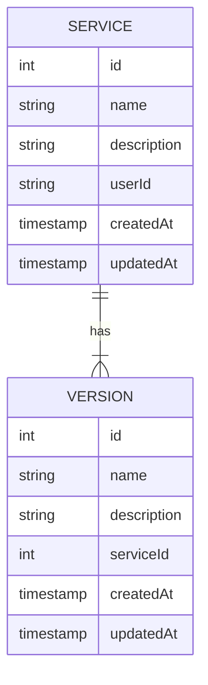

# Catalog service

## Overview

The Catalog service is responsible for managing Services and Versions. It provides a RESTful API on catalog data for performing CRUD operations. It includes token authentication feature.

## Features

- Create, update, delete and get services
- Create, update, delete and get versions for given service
- Search for services in catalog
- Support for pagination, filtering and sorting

## Architecture

### Entities



### Authentication

The application uses JWT bearer token to provide security to all endpoints. The token should contains the following claims:

- **sub**:  the user id
- **username**:  the username
- **roles**: the roles that users has

The **auth guard** will provide to check the token validity and to enrich the request with a **principal** field, that can be used to retrieve the properties of the user that has been authenticated.

```typescript
export class Principal {
  readonly id: string;
  readonly name: string;
  readonly roles: string[];
}
```

In the controller the request can be injected and the principal can be used in the following way:

```typescript
async find(
  @Request() request,
  @Query(ServicePageRequestPipe) pageRequest: PageRequest):  Promise<Page<ServiceDto>> {
    return this.catalogService.find(request.principal, pageRequest);
}
```

There is also a utility endpoint at `http://localhost:3000/auth/login`  that can be used to retrieve a valid JWT token and perform API calls from Swagger UI or any HTTP client. There are two users that can be used for testing:

- username: **bob**

  password: **changeme**
- username: **alice**
  
  password: **guess**

Valid users are hardcoded in `src/auth/auth.repository.ts`. Of course, this endpoint is not intended to be delivered in production.

### Pagination

There is a dedicated module that brings pagination DTOs to endpoints, like search. It provides a request model like the following:

```typescript
export class PageRequest {
  readonly direction?: Direction = Direction.ASC;
  readonly sort?: string;
  readonly page?: number = 1;
  readonly size?: number = 10;
}
```

This is a generic implementation and can be reused where needed.

### Validations

All validations are performed by the `ValidationPipe` by Nest.js.
For endpoints that provide paginations, there is a specific pipe in `src/pagination/pipes/page-request.pipe.ts` that validates the fields that can be sortable.
Entities fields can be annotated with `@Sortable` decorator, that refers to fields can be used in the `sort` query parameter.
This prevents any SQL injection attempts on `sort` query parameter.

### Search

The application can perform full text searches for services. The endpoint is `http://localhost:3000/v1/services/search` and it accepts a `PageRequest` and a `q` string with minimum lenght of 3 chars, for preventing searches that can lead to performance issues. The full text search can works only on Postgres database.

```typescript
  async search(
    @Request() request,
    @Query() query: SearchQueryDto,
    @Query(ServicePageRequestPipe) pageRequest: PageRequest,
  ): Promise<Page<ServiceDto>> {
    return this.catalogService.search(request.principal, query.q, pageRequest);
  }
```

## Tech stack

- Node.js
- Nest.js
- TypeORM
- Postgres
- Jest

## Installation

- Install dependencies:
  
  `> npm install`
- Run migrations:

  `> npm run migration:up`
  
  The database configuration for migrations can be located at `src/database/migration.config.ts`
- Run the application:

  `> npm run start`
  
  The configuration of the application is located at `config/configuration.yaml`

## Swagger UI

The swagger UI is available at <http://localhost:3000/api>

## Future improvements

- Add more test cases
- Improve controller responses with specific DTOs
- Add a full featured mapper for translating entities to DTOs
